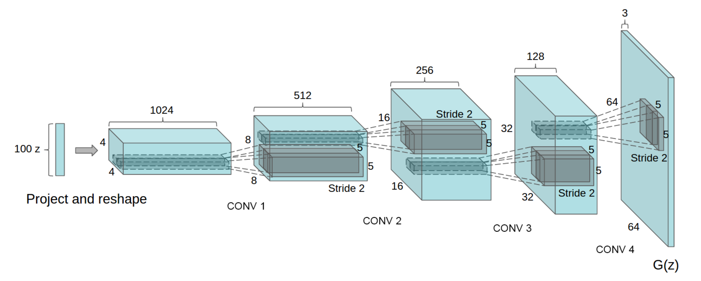

# DC-GAN

This code is heavily influenced by https://pytorch.org/tutorials/beginner/dcgan_faces_tutorial.html.

My contributions are:

1- Using Upsample and Conv instead of ConvTranspose.

2- Adding checkpoints in order to continue training from where the previous training has been stopped.

3- Using SummaryWriter to visualize changes that have been made during training and also make a plot of loss function per training steps.

Fig.1 - DCGAN Generator Architecture

